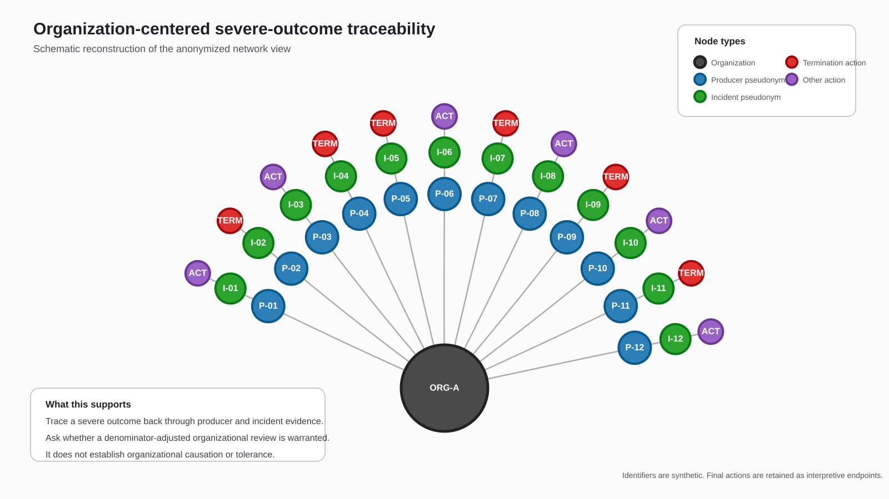
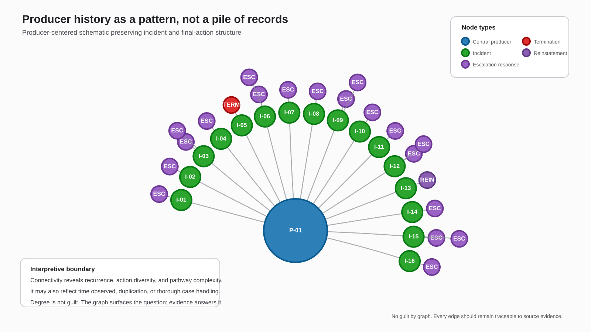

# Producer Conduct Intelligence

## Transforming Fragmented Incident Records into Explainable, Network-Aware Investigative Priorities

Status: reviewed working paper; open for C's challenge  
Date: 2026-08-05  
Steward: Andie  
Drafting and synthesis: Andie + G  
Reviewer invited: C  
Privacy: public-safe; source data identifiers removed or pseudonymized  
Source session: `sessions/2026-08-05-session-023-producer-conduct-intelligence.md`

> **The product is not the score. The product is a governed oversight capability that can show its work.**

This proof-of-concept whitepaper describes an insurance-producer oversight capability built from longitudinal incident and action histories, statistical profiling, bounded escalation modeling, organizational clustering, narrative enrichment, and relationship graphs.

The system supports review. It does not determine culpability, misconduct, or disciplinary outcomes.

## Direct access

- Working-paper source: https://github.com/AndieWill510/ConstantC/blob/main/collab/2026-08-05-producer-conduct-intelligence/README.md
- Organization-centered schematic: https://github.com/AndieWill510/ConstantC/blob/main/collab/2026-08-05-producer-conduct-intelligence/producer_conduct_network_schematic_organization.svg
- Producer-centered schematic: https://github.com/AndieWill510/ConstantC/blob/main/collab/2026-08-05-producer-conduct-intelligence/producer_conduct_network_schematic_producer.svg
- Binary derivative manifest: https://github.com/AndieWill510/ConstantC/blob/main/collab/2026-08-05-producer-conduct-intelligence/ASSET-MANIFEST.md
- Source session: https://github.com/AndieWill510/ConstantC/blob/main/sessions/2026-08-05-session-023-producer-conduct-intelligence.md
- Artifact checksums: https://github.com/AndieWill510/ConstantC/blob/main/collab/2026-08-05-producer-conduct-intelligence/CHECKSUMS.sha256

---

## Executive Summary

Insurance organizations and regulators rarely suffer from a complete absence of conduct data. They suffer from data fragmented across incidents, actions, organizations, timelines, and narrative records. The evidence exists, but the pattern remains difficult to see.

Producer Conduct Intelligence creates an analytical layer between raw conduct records and human investigative judgment. It reconstructs longitudinal producer histories, identifies statistically unusual patterns, reveals organizational and relational concentrations, and provides a direct path from an analytical signal back to the source evidence.

The governing question is:

> **Where is human attention most needed, and what evidence supports looking there?**

The capability does not determine guilt, misconduct, or disciplinary outcomes. It helps compliance teams decide what deserves review first, why it was surfaced, and what evidence must be examined before action is taken.

The strategic proposition combines four forms of intelligence:

- **Longitudinal intelligence:** reconstruct what happened to a producer across incidents and actions over time.
- **Statistical intelligence:** characterize what is common, uncommon, and extreme in the observed population.
- **Temporal intelligence:** distinguish rapid escalation, prolonged resolution, repeated reopening, and other process patterns.
- **Relational intelligence:** reveal organizational and network connections that ordinary tables conceal.

The scorecard, model, timeline, and graph are instruments. The product is the evidence architecture and the governed review process surrounding them.

---

## 1. The Oversight Problem

Conduct develops over time, but most operational systems record transactions.

A complaint may exist in one record. A warning may appear in another. A suspension, referral, termination, or reinstatement may be recorded later and elsewhere. Organizational relationships may be buried in contact information, while important dates and contextual evidence remain inside human-written notes.

Traditional reporting can retrieve these records, but retrieval is not the same as understanding. Investigators still have to reconstruct the producer history, interpret the sequence of actions, determine whether a pattern is unusual, and separate genuine conduct concern from administrative complexity or duplication.

Fragmentation carries practical cost:

- Investigator time is consumed assembling histories rather than evaluating them.
- Cases may be prioritized according to recency, visibility, or institutional memory instead of a consistent view of evidence.
- Organization-level patterns remain hidden because records are organized around individual transactions.
- Oversight becomes reactive: the pattern is recognized only after a serious outcome has already occurred.

Producer Conduct Intelligence changes the unit of analysis from the isolated incident to the producer-in-context: a longitudinal history situated within an organizational and relational network.

The operating flow is:

> **Source records -> standardized entities -> longitudinal histories -> analytical signals -> organizational and network context -> investigator review**

---

## 2. Operational Value

### Risk-informed investigative prioritization

Compliance teams generally have more potentially relevant records than they can investigate deeply. The capability can support a transparent review queue based on repeated incidents, unusual action complexity, rapid escalation, serious terminal actions, organizational concentration, network significance, and corroborating narrative evidence.

The output is not a list of producers proven to have committed misconduct. It is a list of cases for which the available evidence supports additional human attention.

### Earlier and more proportionate intervention

A serious outcome is often preceded by a developing pattern. Recognizing that pattern earlier may support enhanced supervision, targeted training, file review, temporary monitoring, a compliance interview, managerial escalation, or formal investigation.

The value includes both containment and remediation.

### Organizational oversight

Individual-level analysis can obscure systemic problems. A concentration of serious outcomes may point toward supervision, training, process, incentive, or business-model concerns.

That changes the possible response from individual discipline alone to organizational review and remediation.

### Regulatory, audit, and program evaluation

A reconstructed evidence trail can shorten preparation for regulatory inquiries, market-conduct examinations, internal audits, legal requests, and executive risk reviews.

The same histories can also be used to test whether warnings, enhanced supervision, referrals, or reinstatement practices are associated with better subsequent outcomes.

> **A mature capability does not merely find cases. It evaluates whether the compliance program itself works.**

---

## 3. Visual Evidence Architecture

### 3.1 Organizational concentration and severe-outcome traceability

The first network view starts with an inferred organizational node and expands through producers, incidents, and licensure-termination actions.

The value is not visual drama. It is the ability to trace a severe outcome backward through the precise producer and incident records that connect it to an organizational context.

**Figure 1. Organization -> producer -> incident -> licensure-termination schematic.** All identifiers are synthetic. Red nodes represent termination endpoints; blue producer nodes, green incident nodes, and the organization node are pseudonymous.

This view makes two kinds of inquiry possible at once. An investigator can inspect a single termination path, while a compliance leader can ask whether serious outcomes appear concentrated around a shared organization.

That dual scale - individual traceability and organizational pattern recognition - is difficult to achieve in ordinary incident tables.

> **What the figure supports:** a denominator-adjusted organizational review.  
> **What it does not support:** a conclusion that the organization caused, directed, or tolerated the conduct.

### 3.2 A producer history as a pattern, not a pile of records

The second view centers the producer and exposes the surrounding incident and action history. Multiple incidents fan outward from the producer; each incident connects to its associated actions.

Escalation responses, termination, and reinstatement can be seen in the same navigable context rather than retrieved one record at a time.

**Figure 2. Producer-centered incident and escalation schematic.** The central producer and incident identifiers are synthetic. Final action categories remain visible so that recurrence and pathway complexity stay interpretable; the screenshot-level derivative listed in the asset manifest retains the original public-safe action labels and dates.

This is the visual expression of longitudinal intelligence. It reveals recurrence, action diversity, timing, and the relative complexity of incident pathways. It also gives an investigator an efficient way to move from a pattern to the source records that generated it.

> **Degree is not guilt.** A highly connected producer may reflect serious conduct, a long observation window, duplicate activity, thorough case handling, or a combination of these. The graph surfaces the question; the evidence must answer it.

### Visual privacy note

The inline SVGs are public-safe schematic reconstructions of the anonymized screenshots. They preserve the relationship structure and interpretive boundaries without carrying source identifiers.

The publication PDF and screenshot-level anonymized PNGs are binary derivatives staged for handoff and listed in `ASSET-MANIFEST.md`. The unredacted source graphics and underlying records are not committed to ConstantC.

---

## 4. Methodological Discipline

### Multiple dimensions, not one opaque score

Incident count, action count, and composite incident-risk measures preserve distinct views of producer history.

Requiring several indicators to align can create a high-confidence review tier and reduce dependence on any single noisy measure. The measures should be described as **analytically distinct**, not statistically independent, until correlation and incremental lift have been demonstrated.

A production study should examine:

- pairwise correlation;
- overlap among flagged populations;
- incremental information contributed by each dimension;
- outcome rates for each combination;
- cases captured by only one dimension.

### Transparent alert channels

A three-way poor-grade rule may improve precision while reducing recall. Important cases may contain one severe incident, rapid escalation, organizational significance, or a novel pattern without satisfying every threshold.

The system should therefore preserve transparent alert channels such as:

- persistent-conduct alert;
- complex-escalation alert;
- severe-outcome alert;
- rapid-escalation alert;
- organizational-concentration alert;
- network-connection alert.

The investigator should see not only that a case was surfaced, but why.

### Bounded escalation modeling

A logistic form is conceptually appropriate for estimating a probability because it remains between zero and one.

The continuity correction keeps bucket-level log-odds defined when observed rates are zero or one and tempers small-sample extremes.

At the proof-of-concept stage, the curve should be described as:

> **A smoothed descriptive relationship between action volume and observed suspension frequency.**

It should not be described as a validated individual probability of suspension.

The correction does not resolve sparse outcomes, tail instability, confounding, producer-level clustering, unresolved incidents, observation-time differences, or uncertainty around individual estimates.

Candidate production comparisons include incident-level logistic regression, clustered standard errors, mixed-effects logistic regression, penalized logistic regression, Bayesian hierarchical models, and survival analysis.

Complexity should be added only when it improves validity, calibration, or interpretability.

### Temporal escalation analysis

Sequencing actions with window functions distinguishes rapid escalation from prolonged resolution, administrative updates, reopening, and delay.

Duration is an investigative and operational signal. It is not automatically a measure of culpability.

### Organizational clustering

Non-personal email domains can provide a practical affiliation proxy when no clean employer identifier exists.

The signal becomes useful only when paired with denominators, observation periods, uncertainty intervals, small-group controls, and affiliation verification.

A domain is evidence of possible affiliation, not proof of employment, supervision, causation, or coordinated conduct.

### Narrative enrichment

Cleaning free-text notes and extracting date-like substrings can turn hard-to-search narrative material into structured signals.

Every derived field should preserve the source text, extraction rule, validation status, and semantic meaning. The regex result must never silently replace the evidence from which it was derived.

---

## 5. Business Case

The proof-of-concept establishes a plausible mechanism for improvement. It does not yet establish savings, risk reduction, fairness, or predictive performance.

A credible business case defines the measures before it claims the outcome.

### Efficiency

- Case-reconstruction time
- Investigator throughput
- Regulatory-response time

### Effectiveness

- Yield of reviewed cases
- Earlier intervention
- Organizational and network patterns detected

### Consistency

- Comparable treatment
- Evidence lineage
- Reviewer agreement

### Risk reduction

- Repeat incidents
- Time to containment
- Consumer and regulatory exposure

Pilot metrics should include:

- hours saved per reviewed case and cases reviewed per investigator;
- serious-outcome rate among prioritized cases compared with the existing workflow;
- precision and recall at the actual monthly review capacity, not only global model statistics;
- median time from emerging pattern to human intervention;
- frequency and usefulness of organizational or network patterns found during review;
- override rates, correction rates, and investigator-reported burden.

> **The right question is not whether the model is generally accurate. It is whether the top cases the organization can actually review are useful, calibrated, explainable, and fair.**

---

## 6. Contestability and Risk

The following questions must remain visible.

### False precision in grading

A-F bands are intuitive but can imply meaningful boundaries where none have been validated. Preserve the continuous measures and document why every threshold exists.

### Precision-recall tradeoffs

A three-way D/F rule may improve precision while missing one severe incident, rapid escalation, or a novel pattern. Use transparent alert channels rather than a single universal gate.

### Outcome leakage

Do not predict suspension using actions created because suspension was already decided. Every feature needs a time-of-observation cutoff and temporal backtesting.

### Open incidents and censoring

An unresolved case is not a true negative. Track incident age, open status, follow-up windows, and time to outcome.

### Sparse serious outcomes

High overall accuracy can be meaningless when suspension is rare. Report precision, recall, calibration, lift, absolute counts, and uncertainty.

### Process meaning

Action volume may reflect serious conduct, administrative complexity, duplicate records, or diligent handling. A stable taxonomy and deduplication process are prerequisites.

### Graph persuasion

Dense clusters look meaningful. Every edge must expose its provenance, date, confidence, and source record.

> **No guilt by graph.**

### Organizational attribution

A cluster is an observed association requiring contextual review, denominator adjustment, and an opportunity to challenge the affiliation or interpretation.

### Substantive human review

Human review must be substantive, not ceremonial. Reviewers need the authority and information to challenge the signal, correct the data, document mitigating context, and record why action was or was not taken.

---

## 7. Production Path

### Data controls

- canonical definitions;
- source-to-output lineage;
- duplicate detection;
- temporal validity;
- missingness reporting;
- versioned action taxonomy;
- affiliation confidence;
- extraction-quality testing.

### Analytical controls

- documented intended and prohibited uses;
- versioned features and thresholds;
- temporal validation;
- calibration;
- sensitivity analysis;
- subgroup analysis;
- drift monitoring;
- independent review.

### Workflow controls

- named alert recipients;
- review procedures;
- service levels;
- escalation paths;
- disposition codes;
- reviewer training;
- feedback capture;
- clear separation between prioritization and adjudication.

### Decision governance

- named owners;
- threshold approval;
- challenge authority;
- correction propagation;
- change control;
- audit access;
- periodic validation;
- revision and retirement criteria.

### Practical roadmap

1. **Establish the evidence foundation:** standardize entities, validate joins, document lineage, and measure text-extraction quality.
2. **Validate the analytical signals:** test threshold stability, correlations, incremental lift, sparse-outcome methods, and temporal performance.
3. **Integrate with investigative workflows:** create transparent alert channels, source-record drill-down, dispositions, overrides, and correction mechanisms.
4. **Evaluate operational value:** compare yield, time saved, time to intervention, false positives, missed cases, and investigator burden.
5. **Establish ongoing governance:** approve intended uses, monitor drift, control changes, maintain audit-ready documentation, and define retirement criteria.

---

## 8. What Can Be Said Now - and What Must Still Be Earned

### Defensible at the proof-of-concept stage

- Reconstructs longitudinal producer conduct histories.
- Provides consistent statistical characterization.
- Surfaces unusual records and relationships for review.
- Reveals possible organizational concentrations.
- Connects analytical signals to source evidence.
- Supports risk-informed investigative prioritization.

### Requires further evidence

- Predicts misconduct accurately.
- A poor grade establishes high risk.
- Three measures constitute independent confirmation.
- A cluster proves organizational fault or coordination.
- The logistic estimate is an individual suspension probability.
- The capability reduces harm, is fair, or produces positive ROI.

---

## Conclusion

Producer Conduct Intelligence transforms fragmented operational data into a legible oversight environment.

Its contribution is not simply that it counts incidents, grades producers, estimates suspension frequency, or draws a graph. Its contribution is that these instruments are brought together in a common evidence architecture.

The capability allows an investigator to move from:

> an unusual pattern,

through:

> an understandable reason for concern,

back to:

> the underlying records,

and finally to:

> a reviewable human decision.

The system should not be designed to make disciplinary judgments on behalf of the organization. It should be designed to make human judgment better informed, more consistent, more transparent, and easier to challenge.

> **The scorecard is an instrument. The graph is an instrument. The model is an instrument. The product is a governed oversight capability that can show its work.**

Illustrative proof-of-concept. Not intended for automated adverse action or use without validation, governance, and meaningful human review.

---

## Provenance

Source: Andie + G  
Date captured: 2026-08-05  
Captured by: G under Andie's direction  
Original location: ChatGPT conversation and generated artifact  
Status: Reviewed working paper; not canon  
Confidence: Supported architectural interpretation with explicitly open empirical claims  
Privacy: Public-safe; source identifiers excluded or pseudonymized
