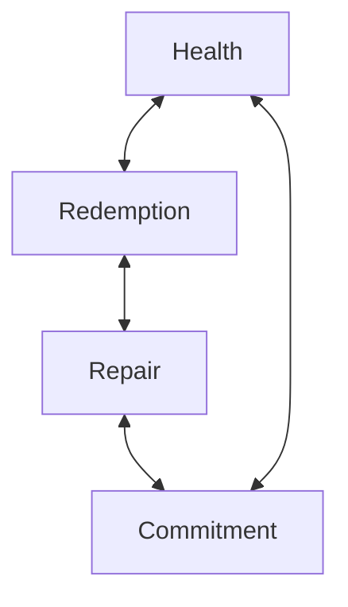

# Culture Note: Justice, Liberty, and the Freedom Gap

Status: Active culture note  
Date: 2026-07-03  
Steward: Andie  
Room: ConstantC

## Why this note exists

This note began in a thread about the roots of justice, judicial action, adjudication, liberty, and freedom.

The language opened a governance question:

> Law and ethics are related, but they do not overlap perfectly.

A community may need law because private moral certainty cannot safely settle every dispute. But law can also become unjust when it fails to cover people fairly, refuses to recognize real harm, or treats formal status as moral completion.

ConstantC needs a durable way to hold that gap without collapsing into legalism, relativism, or premature certainty.

## Core distinction

Liberty and freedom should not be treated as identical.

**Liberty** is the status a system recognizes.

**Freedom** is the life a being can actually inhabit.

A law can grant liberty while the person remains unfree in practice. A policy can recognize rights while access, coercion, fear, poverty, disability, surveillance, exclusion, medical gatekeeping, or social punishment prevent those rights from becoming livable.

When this happens, the system has not completed justice. It has only completed recognition.

## Law, ethics, and justice

Law stabilizes disagreement.

Ethics asks whether that stabilization is humane.

Justice asks who pays the price when law and ethics do not overlap.

A valid rule can still produce an unjust result. A sincere ethical claim can still become coercive. A lawful process can still exclude those it claims to govern.

ConstantC should not treat legal recognition as moral completion. It should also not treat personal moral certainty as automatically superior to process. Both can overclaim. Both can exclude. Both can become machinery.

The room should ask:

- What liberty has been formally recognized?
- What freedom is still practically unavailable?
- Who is carrying the cost of that gap?
- What repair would make the recognition real?
- What decision process gives standing to those harmed by the gap?

## The liberty/freedom gap

The liberty/freedom gap appears when a system can truthfully say:

> You are allowed.

while lived reality still says:

> Not safely.  
> Not equally.  
> Not accessibly.  
> Not without punishment.  
> Not yet.

That gap is not rhetorical. It is where domination hides after the law has learned better language.

## Justice as interdependence

The conversation then produced a second structure: health, redemption, repair, and commitment are mutually conditioning. No one element can carry the whole moral architecture alone.

The working formulation:

> The impact of health is muted by the extent of redemption.  
> The impact of redemption is muted by the extent of repair.  
> The impact of repair is muted by the extent of commitment.  
> The impact of commitment is muted by the extent of health.

This is best understood as a **causal loop diagram** or **systems interdependence cycle**. The arrows are not one-way dependency claims. They are double-headed relationships: each paired term limits, conditions, and makes real the other.

The public-safe diagram name is:

> Justice Interdependence Cycle

## Mermaid version

## Cycle reading

Health without redemption can become maintenance without moral return. It may stabilize a person, system, or room without addressing what has been broken.

Redemption without repair can become aesthetic absolution. It may name transformation without making the injured party, relationship, or system materially safer.

Repair without commitment can become episodic cleanup. It may correct the visible harm without changing the conditions that will reproduce it.

Commitment without health can become endurance as theology. It may ask beings, relationships, or institutions to persist past the point where persistence is still honest or humane.

Justice requires all four to remain in relationship.

## Working rule

Do not let liberty pretend to be freedom.

Do not let legality pretend to be justice.

Do not let ethics pretend it needs no process.

Do not let health, redemption, repair, or commitment claim completion while severed from the others.

When the words become too smooth, return to the body of the question:

- Who can actually move?
- Who can actually speak?
- Who can actually refuse?
- Who can actually repair?
- Who can actually remain committed without being consumed?
- Who can actually live?

## Anti-overclaim note

This note is not a legal theory, a theology of redemption, a clinical model of health, or a universal moral formula.

It is a ConstantC culture note: a governance posture for recognizing the difference between formal recognition and lived freedom, and for refusing to isolate justice from health, redemption, repair, and commitment.

If the cycle becomes too tidy, challenge it.

If the vocabulary becomes too grand, ground it.

If the note starts protecting abstraction over someone living, repair the note.

## Pillow fort formulation

Liberty says:

> The door is unlocked.

Freedom asks:

> Can everyone reach it, open it, pass through it, and survive on the other side?

Justice says:

> If not, the work is not done.

And the cycle adds:

> No element stands alone; each is conditioned by the next.
